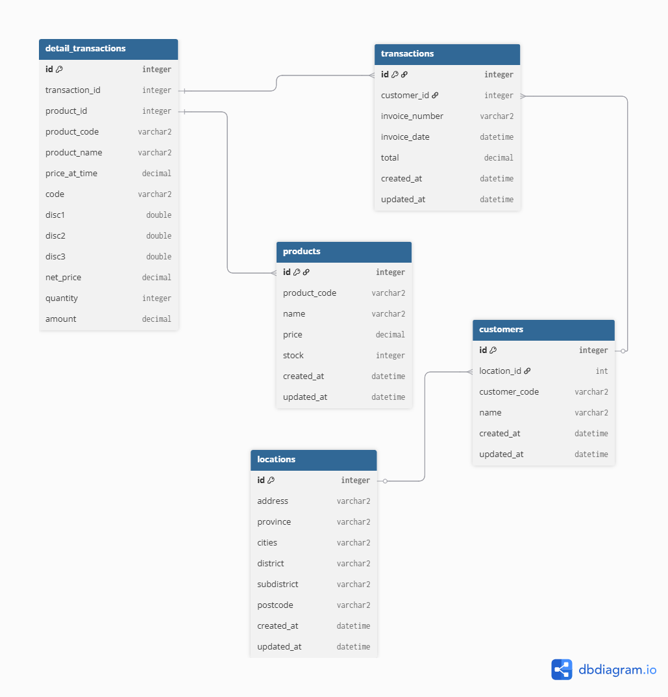

# Transaction Management System

A modern web application built with Laravel and Vue.js for managing transactions, customers, and products with multi-tier discount calculations and stock management.

## 🚀 Features

- **Customer Management**: Full CRUD operations with Indonesian location data
- **Product Management**: Inventory tracking with real-time stock management
- **Transaction System**:
    - Multi-tier discount calculations (3-level discounts)
    - Real-time stock validation
    - Automatic invoice generation
    - Transaction history with detailed breakdowns
- **Dashboard**: Overview of business metrics and recent activities
- **Responsive Design**: Modern UI with dark/light theme support

## 🛠 Tech Stack

**Backend**

- Laravel 12 - PHP web framework
- SQLite - Database (easily switchable to MySQL/PostgreSQL)
- Inertia.js - Server-side rendering with SPA experience

**Frontend**

- Vue 3 - Progressive JavaScript framework
- TypeScript - Type safety
- Tailwind CSS - Utility-first CSS framework
- PrimeVue - Vue UI component library
- Vite - Fast build tool

## 🛢 Design ERD (Entity Relational Diagram)



## 📋 Requirements

- PHP 8.2 or higher
- Node.js 18 or higher
- Composer
- Git

## 🔧 Installation

### 1. Clone Repository

```bash
git clone <your-repository-url>
cd test-it-development
```

### 2. Backend Setup

```bash
# Install PHP dependencies
composer install

# Setup environment
cp .env.example .env
php artisan key:generate

# Create and setup database
touch database/database.sqlite
php artisan migrate --seed

# Seed Indonesian location data (provinces, cities, districts, villages)
php artisan laravolt:indonesia:seed
```

### 3. Frontend Setup

```bash
# Install Node dependencies
npm install

# Build assets
npm run build
```

## 🚀 Running the Application

### Quick Start (Recommended)

```bash
composer run dev
```

This starts all services: Laravel server, queue worker, logs, and Vite dev server.

Access the application at: **http://localhost:8000**

### Manual Start

```bash
# Terminal 1
php artisan serve

# Terminal 2
npm run dev
```

## 📚 Available Commands

```bash
# Development
composer run dev           # Start all dev servers
npm run dev               # Vite dev server only

# Laravel
php artisan migrate       # Run migrations
php artisan db:seed      # Seed database
php artisan laravolt:indonesia:seed  # Seed Indonesian location data
```
